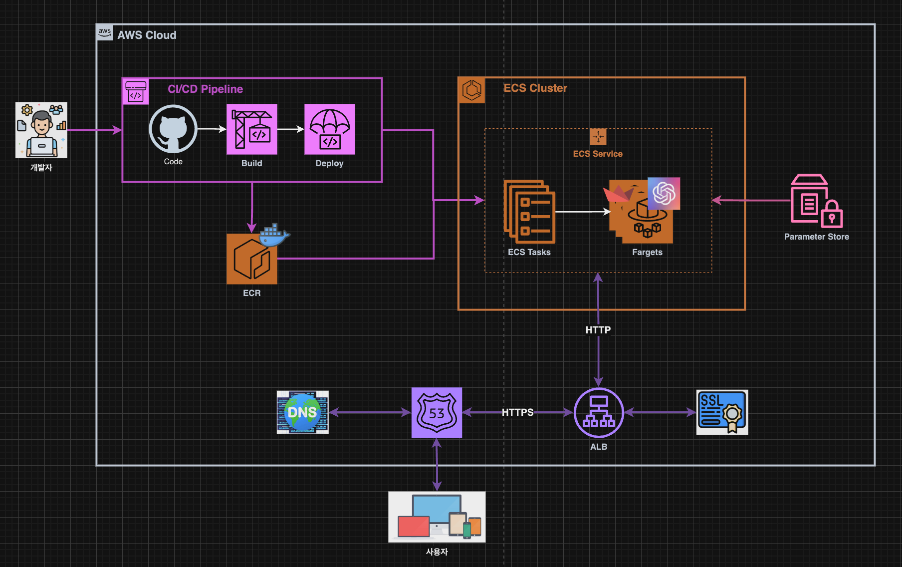

# Architecture


---
# ChatBot on Docker

---
### 단계1: [Dockerfile](https://docs.streamlit.io/deploy/tutorials/docker)


---
### 단계2: Make docker image
- 명령어: `docker build --platform linux/amd64 -t [이미지명] .`
```shell
# Make docker image
docker build --platform linux/amd64 -t streamlit-image .
docker images # 생성된 이미지 확인 
```


---
### 단계3: Run container
- 명령어: `docker run --name [컨테이너명] -d -e [환경변수] -p 8501:8501  [이미지명]`
```shell
# 리눅스
docker run --name streamlit-container -d \
-e OPENAI_API_KEY=$(aws ssm get-parameters --region ap-northeast-2 \
--name "/TEST/CICD/STREAMLIT/GROQ_API_KEY" --query "Parameters[0].Value" | tr -d '"') \
-p 8501:8501 streamlit-image

docker ps # 실행중인 컨테이너 확인 
```

---
```shell
# 윈도우
docker run --name streamlit-container -d `
-e OPENAI_API_KEY=$(aws ssm get-parameters --region ap-northeast-2 `
--name "/TEST/CICD/STREAMLIT/GROQ_API_KEY" --query "Parameters[0].Value") `
-p 8501:8501 streamlit-image

docker ps # 실행중인 컨테이너 확인 
```


---
### 단계4: 접속 및 실행 
```shell
Local URL: http://localhost:8501
```


---
### 단계5: 참고 
```shell
docker stop streamlit-container # 컨테이너 멈춤 
docker ps -a # 컨테이너 멈춤 확인 
docker rm streamlit-container # 컨테이너 삭제  
docker rmi streamlit-image # 이미지 삭제 
```

