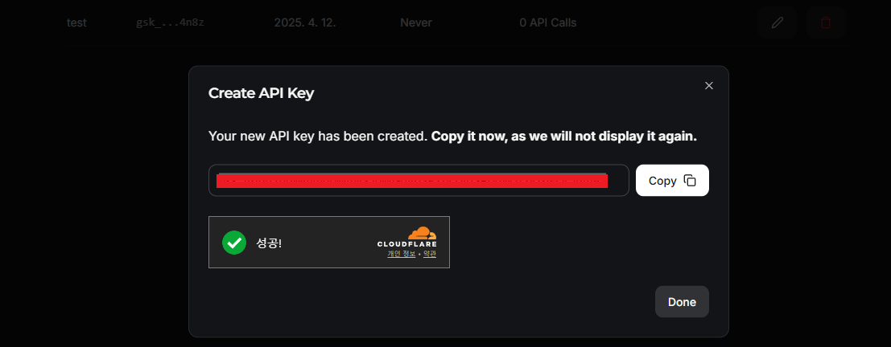

# [uv](https://docs.astral.sh/uv/)
- **uv**는 정말 빠른 **Python 패키지 및 프로젝트 매니저**라고 하며, **Rust**를 기반으로 만들어졌습니다.
  - **Rust(러스트)** 는 모질라 리서치에서 개발한 시스템 프로그래밍 언어로, 성능과 안전성을 중시합니다.

---
### [단계1: uv 설치](https://docs.astral.sh/uv/#installation)
- On Windows.
```shell
# On Windows.
powershell -ExecutionPolicy ByPass -c "irm https://astral.sh/uv/install.ps1 | iex"
```
- On macOS and Linux.
```shell
# On macOS and Linux.
curl -LsSf https://astral.sh/uv/install.sh | sh
```
---
### 단계2: uv 설치 확인 
```shell
uv --version
```


---
### 단계3: uv 파이썬 설치 확인 
```shell
uv python list
```


---
### 단계4: 프로젝트 폴더로 이동


---
### 단계5: 가상환경 생성
> uv venv [가상환경명] -p [파이썬버전] 
```shell
uv venv .venv -p 3.13
```


---
### 단계6: 가상환경 접속
```shell
.\.venv\Scripts\activate
```


---
### 단계7: 라이브러리 설치
```shell
uv pip install -r .\requirements.txt
```


---
# [Groq Cloud](https://console.groq.com/docs/quickstart)
- Groq API는 AI 모델의 추론 속도가 매우 빠른 API 서비스입니다. 
- 구글 Gemma, 메타 Llamma 등 오픈소스 LLM을 GPU 없는 환경에서도 빠르게 테스트하고 서비스를 개발할 수 있는 환경을 제공합니다. (현재 시점에서는 무료 사용이 가능합니다.)

---
## [Groq Cloud Models](https://console.groq.com/docs/models)


---
### 단계1: Groq Model 적용 


---
### 단계2: .env 파일 생성 
> **.env.example 파일**을 이용해서 **.env 파일** 생성 


---
### [단계3: Groq key 발급](https://console.groq.com/keys)


---
- Groq key 복사



---
### 단계4: .env 파일에 Groq key 적용


---
# [Streamlit](https://streamlit.io/)
- Streamlit을 설명한 웹 페이지를 가 보면 "A faster way to build and share data apps (데이터 어플리케이션을 만들고 공유하는 빠른 방법)"이라고 설명되어 있습니다. 
- 즉 데이터를 보여주는 것에 초점을 맞춘 데모용 웹 프레임워크라고 보면 될 것 같습니다.

---
### 단계1: Streamlit 실행 
```shell
streamlit run chatbot.py
```


---
### 단계2: Chatbot 테스트 


