# CodePipeline 삭제 

---
### 단계1: CodePipeline
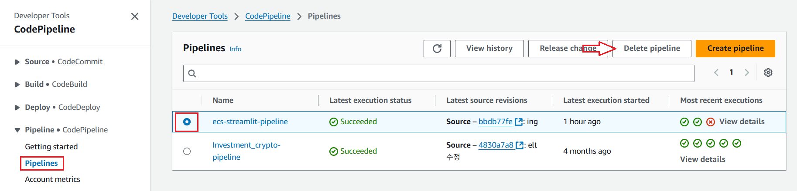

---
### 단계2: Codebuild
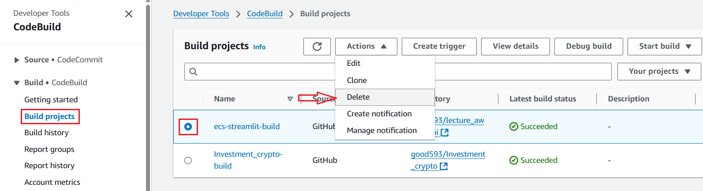

---
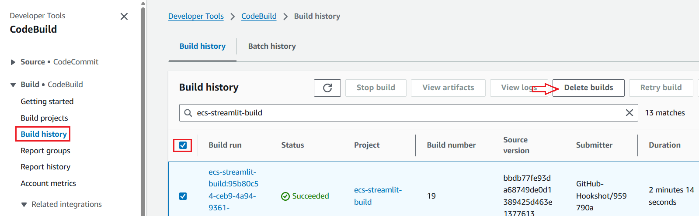

---
### 단계3: Connections
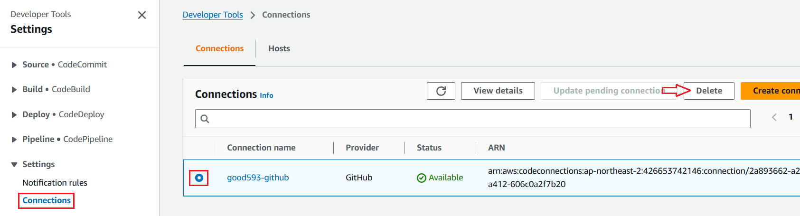

---
# ECS 삭제 

---
### 단계1: Service
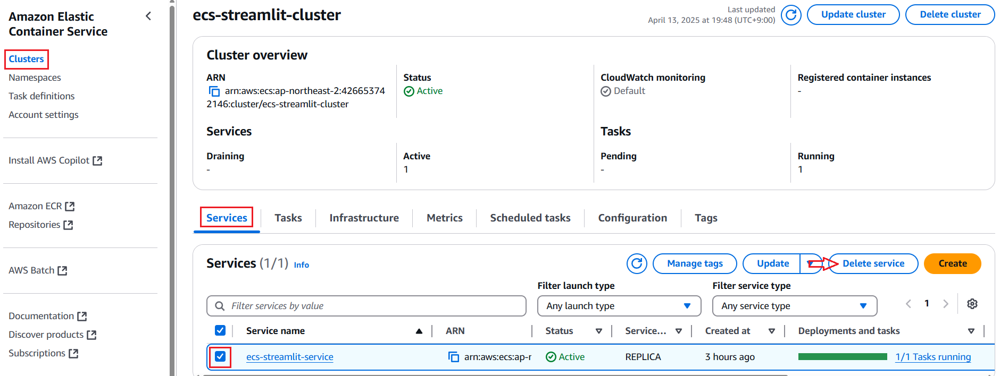

---
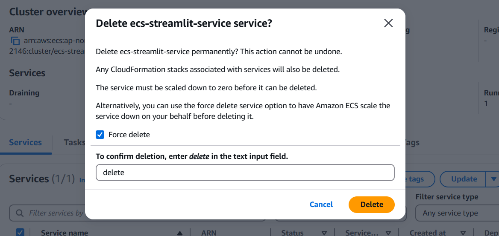

---
### 단계2: Cluster
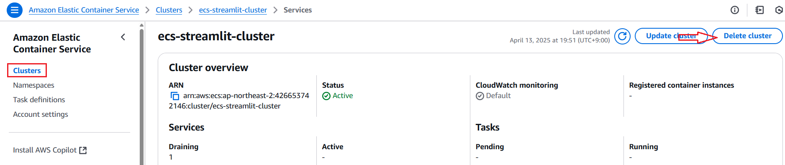

---
### 단계3: Task definitions
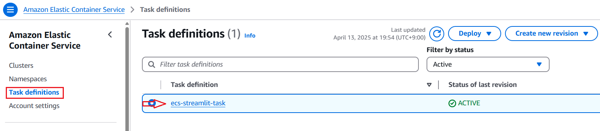

---
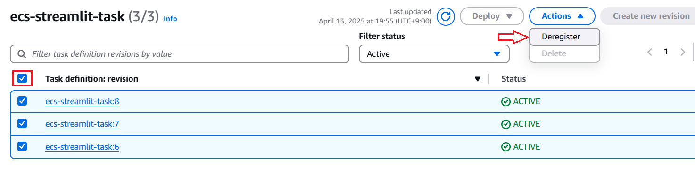

---
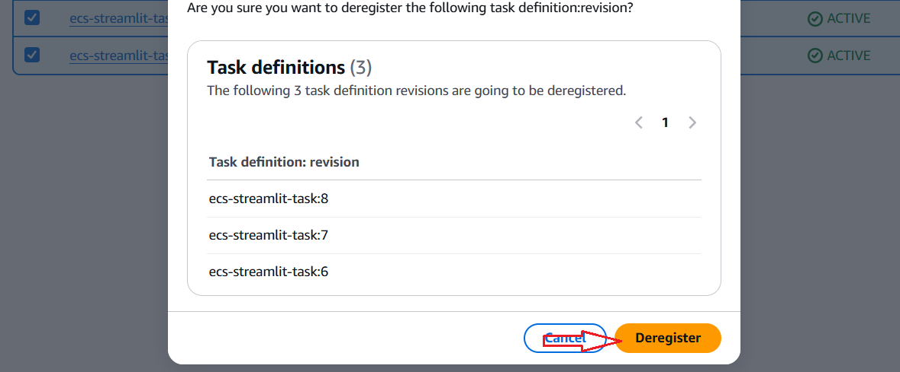

---
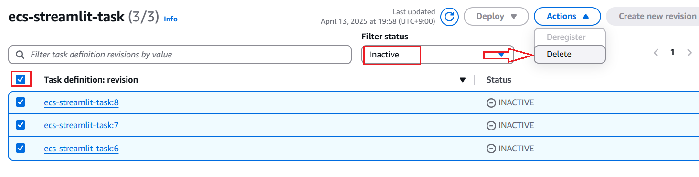

---
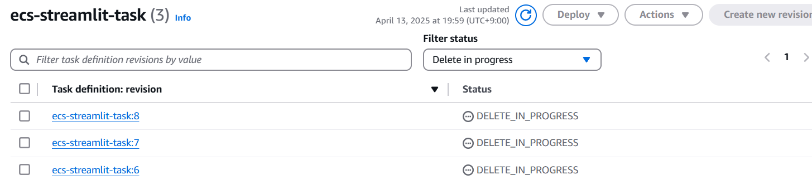

---
# IAM Role 삭제 

---
# 참고
- Parameter Store 삭제 생략 

